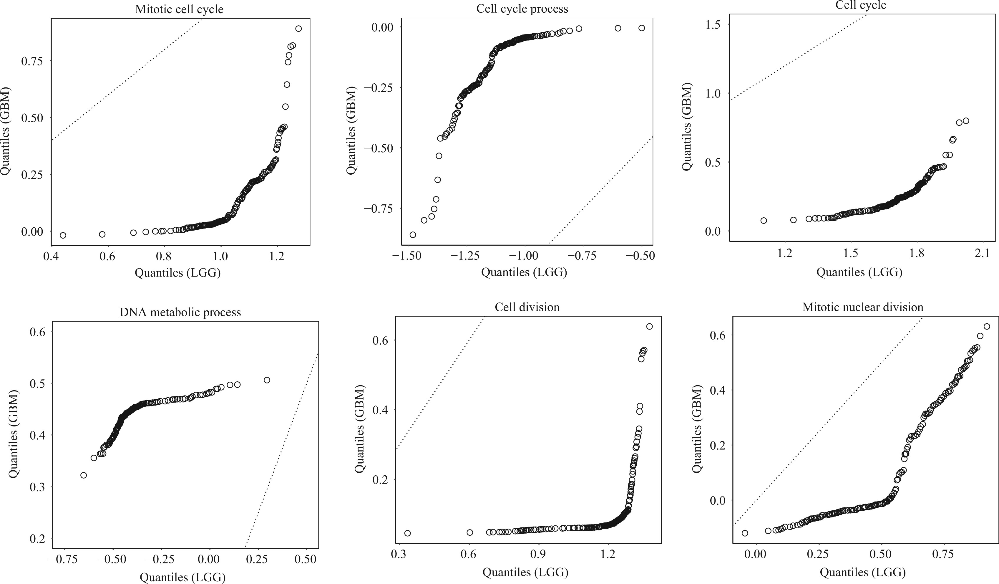
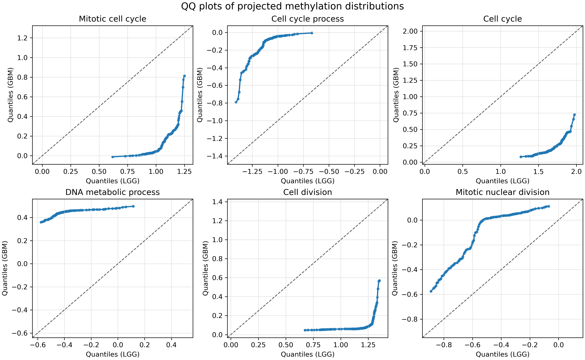

# Fig. 2 复现图与论文图的对比分析

本文档用于解释为什么本次生成的 QQ 图与论文 *Two-sample distribution tests in high dimensions via max-sliced Wasserstein distance and bootstrapping* 中的 Fig. 2 看起来不完全一致，并详细说明六张 QQ 图各自代表的统计含义和实际意义。

## 1. 对比对象

论文原图：

```text
GBM-plot/paper_Figure2_original.jpeg
```

本次复现生成的图为：

```text
GBM-plot/Figure2_QQ_GBM.png
GBM-plot/Figure2_QQ_GBM.pdf
```

此外，还额外生成了一个诊断版本：

```text
GBM-plot/Figure2_QQ_GBM_median_oriented.png
GBM-plot/Figure2_QQ_GBM_median_oriented.pdf
```

其中 `Figure2_QQ_GBM.png` 使用 `GBM_methylation.py` 生成的原始投影方向符号，更接近论文图；`Figure2_QQ_GBM_median_oriented.png` 会人为翻转方向，使 GBM 投影中位数不小于 LGG 投影中位数，因此图像可能与论文图发生镜像差异。

论文原图：



本次复现图：



## 2. QQ 图如何阅读

每个面板对应一个 GO biological process 基因集合。对每个集合，代码先用 max-sliced Wasserstein 方法找到一个最能区分 LGG 与 GBM 的投影方向 `v`，然后把多维甲基化数据投影成一维：

```text
LGG: v^T X
GBM: v^T Y
```

QQ 图中的点是两组投影后一维分布的分位数配对：

```text
x 轴：LGG 组投影分布的分位数
y 轴：GBM 组投影分布的分位数
```

虚线是 identity line：

```text
y = x
```

因此：

- 如果两组投影分布相同，QQ 点应大致落在虚线附近。
- 如果点整体偏离虚线，说明两组在该投影方向上的分布不同。
- 如果点近似平行于虚线但整体上移或下移，主要体现位置差异。
- 如果曲线呈弯曲、S 形、水平段或尾部突变，则说明不仅有位置差异，还可能有方差、偏度、尾部或混合分布形态的差异。
- 注意投影方向 `v` 和 `-v` 在 Wasserstein 距离上是等价的，因此 QQ 图可能整体关于原点镜像。镜像不会改变统计结论。

## 3. 为什么本次图和论文图可能不同

本次图与论文 Fig. 2 的统计结论是一致的：六个 GO term 都显著偏离 `y = x`，说明 LGG 与 GBM 在这些基因集合上的投影分布存在明显差异。

但外观不完全一致，主要有以下原因。

第一，投影方向符号本身不唯一。  
如果 `v` 是最优方向，那么 `-v` 也是等价方向，因为两组同时乘以 `-1` 后，Wasserstein 距离不变。这样 QQ 图会出现横纵坐标同时取相反数的镜像效果。论文图和复现图中某些面板的形状一致但坐标正负相反，主要就是这个原因。

第二，最优方向优化是非凸问题。  
`maxSlicedWDL0_L1Approx` 使用随机初始化多次搜索最优投影方向。代码没有固定随机种子，因此每次运行可能得到略有不同的局部最优方向。即使统计量仍然显著，QQ 曲线的具体形状也可能有小差别。

第三，绘图方式不完全相同。  
当前脚本使用 `0.01` 到 `0.99` 的 99 个分位点，并用蓝色点线连接；论文图使用黑色空心圆点，坐标轴范围和分位点选择也可能不同。这会影响视觉风格，但不改变结论。

第四，论文原始方向文件没有随论文直接给出。  
本项目是根据现有代码重新运行真实数据分析得到 `direction_*.txt`，而不是读取论文作者当时生成 Fig. 2 所用的完全相同方向。因此无法保证图像逐像素一致。

## 4. 六张 QQ 图的具体解释

下面逐一解释六个 GO term 面板。表中的统计量来自本次运行生成的：

```text
GBM/GBM_gene_set_summary.txt
```

由于本次 bootstrap 次数为 `B = 500`，表中 `p_value = 0.0` 应理解为：

```text
p < 1 / 500 = 0.002
```

### 4.1 Mitotic cell cycle

对应文件：

```text
idx_genes_mitotic_cell_cycle.txt
direction_mitotic_cell_cycle.txt
```

本集合包含 `5` 个基因。本次统计量为：

```text
statistic = 9.466548
p < 0.002
```

QQ 图中，曲线明显远离 `y = x`，说明 LGG 与 GBM 在有丝分裂细胞周期相关基因上的联合甲基化分布差异显著。

从图形看，LGG 的投影分位数主要落在较高区间，而 GBM 的投影分位数在较低区间并呈现明显弯曲。这意味着差异不是单个点或少数异常样本造成的，而是在多个分位水平上都存在系统差异。

意义：  
Mitotic cell cycle 与肿瘤细胞增殖、细胞周期调控高度相关。该集合显著，说明 LGG 进展到 GBM 的过程中，细胞周期相关基因的甲基化模式发生了整体性变化。

### 4.2 Cell cycle process

对应文件：

```text
idx_genes_cell_cycle_process.txt
direction_cell_cycle_process.txt
```

本集合包含 `7` 个基因。本次统计量为：

```text
statistic = 10.196108
p < 0.002
```

QQ 图中，曲线整体偏离虚线，并且在低分位处有较明显弯折。这表示两组不只是均值位置不同，分布形态也不同：某些低分位或尾部区域的差异尤其明显。

意义：  
Cell cycle process 是更广义的细胞周期过程集合。该集合显著说明，LGG 与 GBM 的差异并不局限于某几个孤立基因，而可能涉及细胞周期调控网络层面的甲基化改变。

### 4.3 Cell cycle

对应文件：

```text
idx_genes_cell_cycle.txt
direction_cell_cycle.txt
```

本集合包含 `11` 个基因。本次统计量为：

```text
statistic = 15.454372
p < 0.002
```

这是六个论文 Fig. 2 面板中统计量最大的集合之一。QQ 图中曲线距离 `y = x` 很远，说明该 GO term 上的 LGG 与 GBM 投影分布差异非常强。

从复现结果看，该集合的投影中位数差异很大，且多个分位点均明显偏离虚线。这说明 cell cycle 相关基因集合对区分 LGG 与 GBM 非常有信息量。

意义：  
细胞周期异常是肿瘤进展中的核心机制之一。该图支持论文中的生物学解释：GBM 相比 LGG 在细胞周期相关基因的甲基化模式上存在显著变化，可能与更高的恶性程度和增殖活性相关。

### 4.4 DNA metabolic process

对应文件：

```text
idx_genes_DNA_metabolic_process.txt
direction_DNA_metabolic_process.txt
```

本集合包含 `6` 个基因。本次统计量为：

```text
statistic = 8.729650
p < 0.002
```

QQ 图中，GBM 分位数集中在较窄区间，而 LGG 分位数跨度更大，曲线整体明显偏离虚线。这说明两组在 DNA 代谢相关基因集合上不仅存在位置差异，也存在分布集中程度或形态上的差异。

意义：  
DNA metabolic process 与 DNA 合成、修复、复制等过程有关。该集合显著提示 LGG 与 GBM 的 DNA 代谢相关甲基化调控可能不同，这与肿瘤进展中 DNA 修复、复制压力和细胞增殖机制变化有关。

### 4.5 Cell division

对应文件：

```text
idx_genes_cell_division.txt
direction_cell_division.txt
```

本集合包含 `5` 个基因。本次统计量为：

```text
statistic = 11.125883
p < 0.002
```

QQ 图中，曲线在大部分分位区间远离 `y = x`，并且在高分位处出现较陡变化。这种形状表示两组在 cell division 相关方向上的分布差异较强，特别是尾部或高分位区域差异明显。

意义：  
Cell division 与肿瘤细胞快速增殖直接相关。该集合显著说明，细胞分裂相关基因的甲基化分布在 LGG 与 GBM 中存在强差异，是解释肿瘤等级进展的重要信号之一。

### 4.6 Mitotic nuclear division

对应文件：

```text
idx_genes_mitotic_nuclear_division.txt
direction_mitotic_nuclear_division.txt
```

本集合包含 `3` 个基因。本次统计量为：

```text
statistic = 4.131380
p < 0.002
```

这个集合的基因数最少，统计量也小于前几个 cell cycle/cell division 相关集合，但仍然显著。QQ 图中曲线呈明显非线性偏离，说明两组在该投影方向上的差异依然稳定存在。

需要特别注意：该面板最容易因为投影方向符号不同而与论文图出现镜像差异。若把方向 `v` 替换成 `-v`，QQ 图会在坐标上翻转，但距离、p 值和显著性结论完全不变。

意义：  
Mitotic nuclear division 描述有丝分裂中细胞核分裂相关过程。该集合显著说明，即使只看少数相关基因，也能观察到 LGG 与 GBM 在有丝分裂核分裂相关甲基化模式上的差异。

## 5. 六张图共同说明了什么

六张 QQ 图的共同特征是：曲线都明显偏离 `y = x`。这说明 LGG 与 GBM 的差异不是只存在于某一个基因或某一个 GO term，而是在多个与肿瘤进展密切相关的生物过程中同时出现。

这些 GO term 可以概括为三类：

- 细胞周期相关：`mitotic_cell_cycle`、`cell_cycle_process`、`cell_cycle`
- DNA 代谢相关：`DNA_metabolic_process`
- 细胞分裂/有丝分裂相关：`cell_division`、`mitotic_nuclear_division`

它们都与肿瘤细胞增殖、恶性进展和 GBM 的生物学特征高度相关。因此，这些 QQ 图的意义不仅是“统计上显著”，还在于它们给出了可解释的生物学定位：LGG 与 GBM 的甲基化差异集中体现在细胞周期、DNA 代谢和细胞分裂这些关键过程上。

## 6. 结论

本次复现图与论文 Fig. 2 在视觉上不完全一致，主要原因是投影方向符号任意、非凸优化随机性和绘图风格差异。但核心统计结论一致：

```text
六个 GO biological process 基因集合的投影分布都显著偏离 y = x。
```

因此，真实数据分析支持论文结论：max-sliced Wasserstein distance 不仅能够检测 LGG 与 GBM 的整体高维分布差异，还能够进一步定位到具有明确生物学意义的基因集合差异。
